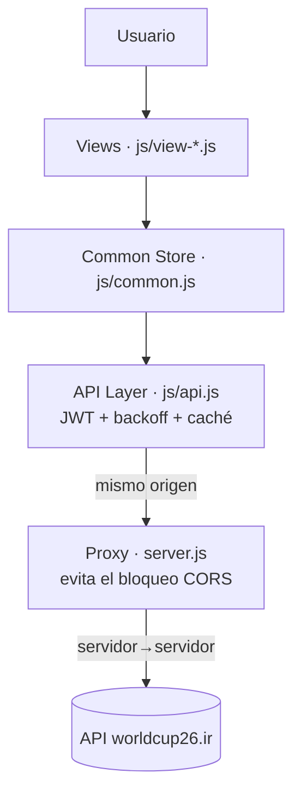

<div align="center">
  

  # Mundial 2026 · Dashboard Integral
  ### Laboratorio 2 · ISW-521 · Categoría B

  Dashboard en **JavaScript Vanilla** para explorar sedes, agenda, calendario, favoritos y resultados del Mundial 2026, consumiendo la API oficial en vivo con una capa de resiliencia (JWT, backoff, offline).

  [](https://github.com/andreyhnzzz/ah-dashboard-lab)
  [](https://worldcup26.ir)
  [](js/app.js)
  [](LICENSE)

</div>

> Proyecto académico sin fines de lucro (ISW-521). El código es MIT; "FIFA World Cup 26" y su identidad visual son marca de la FIFA, usada solo con fines educativos — ver [LICENSE](LICENSE).

## Índice

[Vistas](#vistas) · [Resiliencia](#resiliencia--sesión) · [Stack](#stack) · [Arquitectura](#arquitectura) · [Cómo ejecutarlo](#cómo-ejecutarlo)

## Vistas

| | |
|---|---|
| **[Tour de Sedes](js/view-sedes.js)**<br>Las 16 sedes oficiales; clic para saltar a sus partidos. | **[Agenda Simultánea](js/view-agenda.js)**<br>Días con varios partidos en columnas paralelas. |
| **[Timeline Infinito](js/view-timeline.js)**<br>Los 104 partidos, cargados de a 10 con scroll infinito. | **[Dashboard del Fanático](js/view-fanatico.js)**<br>Equipo favorito con tema de color dinámico. |
| **[Matriz de Enfrentamientos](js/view-matriz.js)**<br>Cuadrícula de resultados por grupo, coloreada por grupo. | **[Login de dispositivo](js/view-login.js)**<br>Sesión JWT persistente, sin credenciales de curso. |

## Resiliencia · sesión

- **JWT real**: cada visita registra o reautentica un dispositivo contra `worldcup26.ir` — sin claves hardcodeadas.
- **Backoff exponencial** ante `429`/`5xx`, con countdown visible.
- **Caché offline**: última respuesta buena se sirve marcada como "no actualizada" si la red falla.
- **401 → re-login** en la misma pantalla, sin perder la vista ni el equipo favorito.
- **Seguridad**: salida escapada (`esc()` en [js/common.js](js/common.js)) + cabeceras en el proxy (CSP, `nosniff`, anti-clickjacking) como segunda capa anti-XSS.

## Stack

| Tecnología | Uso |
|---|---|
| [JavaScript](js/app.js) | Router, estado y lógica de negocio (sin frameworks) |
| [CSS](css/tokens.css) | Design tokens, tipografía autoalojada (Fredoka + Noto Sans), animaciones y paleta oficial |
| JWT + Fetch | Autenticación y consumo de la [API del Mundial 2026](https://worldcup26.ir) |
| LocalStorage | Caché, favorito y sesión de dispositivo |
| IntersectionObserver | Scroll infinito del calendario |

## Arquitectura



## Cómo ejecutarlo

```bash
npm start          # arranca el servidor local con proxy a la API (sin dependencias)
```

Abrir **`http://localhost:8099`**. El primer ingreso registra una identidad de dispositivo y ya se navega con **datos reales y en vivo** del torneo.

> **¿Por qué `npm start` y no un servidor estático a secas?** La API oficial
> no envía cabeceras CORS en `/auth/*`, así que el navegador bloquea el login
> contra `worldcup26.ir` desde cualquier origen. [`server.js`](server.js)
> (Node, cero dependencias) reenvía `/auth/*` y `/get/*` a la API **del lado
> servidor**, donde no hay CORS — así el login funciona de verdad. Con
> cualquier otro servidor estático la app igual arranca, pero cae a datos
> locales de demostración.

---

<div align="center">

Proyecto Final ISW-521 · Categoría B · Interfaces Interactivas y DOM Avanzado

</div>
